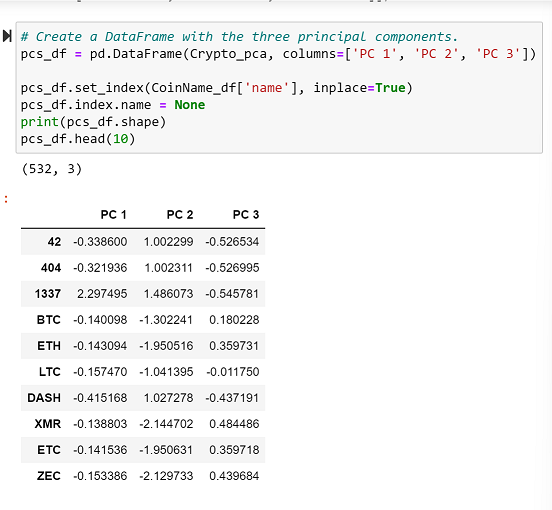
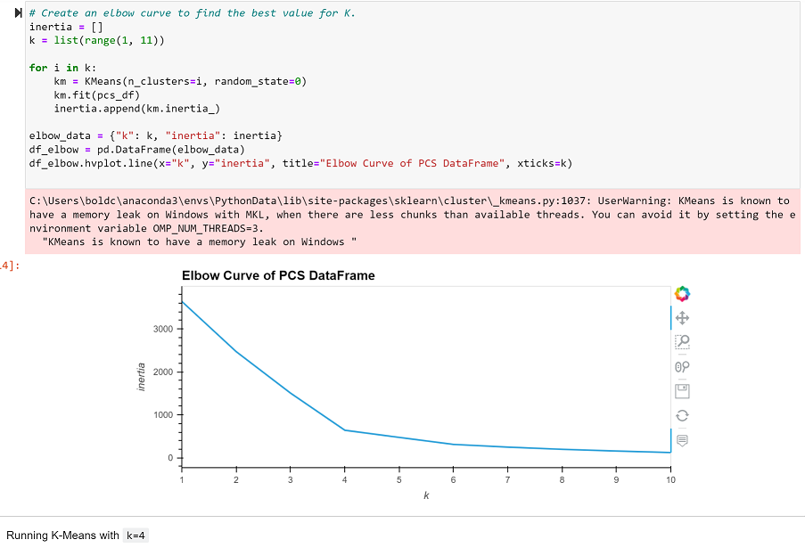
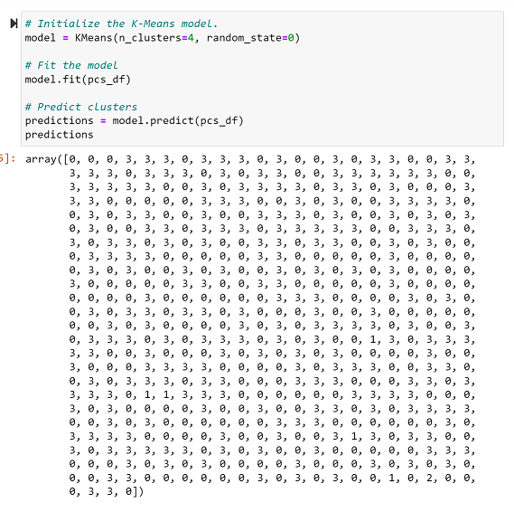
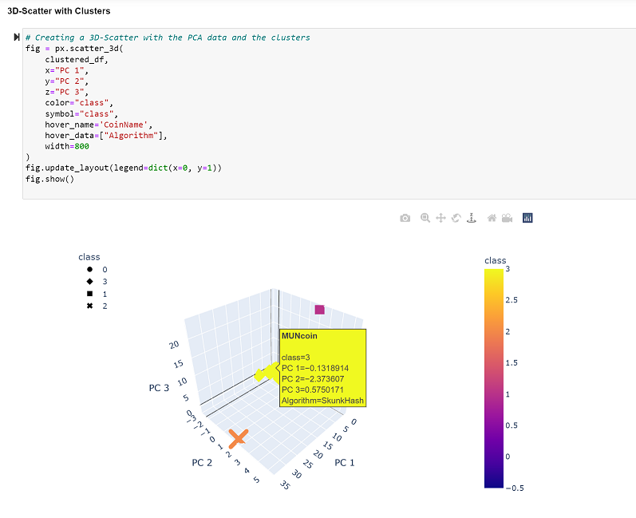
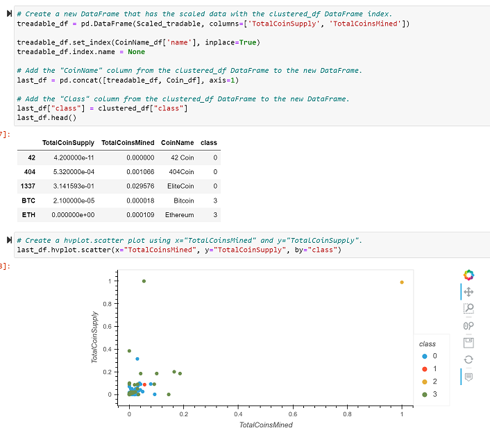

# Cryptocurrencies

# Purpose

Practice using Unsupervised Machine Learning to section and predict bitcoins that will ultimately be profitable.

# Process

- Eliminate null values
- Remove unuseable variables
- Identify and select operating crypto
- Identify and select coin producing crypto
- Scale the cleaned data

# Results

## Number of Clusters (K)

- Condensed remaining features into three principal components. (Below)

- Once the new variables were created, a visual of an Elbow curve allowed me to see how many clsuters I should use. As shown below, the Elbow curved angled at four clusters.

## K-Means

- Create, fit, and transform the model to make predictions. (Below)

# Summary

In using a self-constructed 3-D diagram and scatter plot, it was easy to visualize the outliers. Note the outliers in the upper right and lower left corners in the 3-D diagram. In the scatter  plot, the outliers are Class 2 and 3 bitcoins. (Both shown below)

### 3-D Diagram 

### Scatter Plot 

